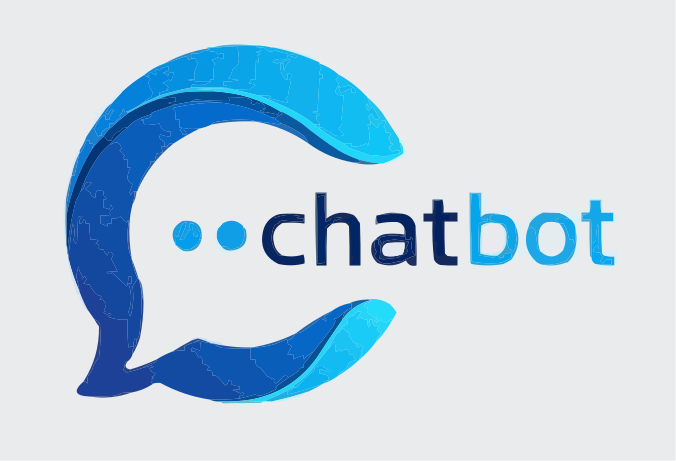

<p align="center">
  
</p>

# React Spring Chatbot

A full-stack, open-source chatbot application that combines the power of **Spring AI** (backend) with **React** (frontend) to deliver intelligent chat completions and AI-powered image generation in a seamless, user-friendly experience.

## 🎯 Project Purpose

This project demonstrates a modern full-stack architecture for building AI-powered applications. It serves as:
- A **learning resource** for developers interested in integrating OpenAI APIs with Spring Boot and React
- A **production-ready foundation** for building custom chatbot applications
- A **best-practices example** for handling user API credentials securely on the client side
- A **template** for extending with additional AI features and integrations

---

## ✨ Key Features

### 💬 Intelligent Chat Interface
- **Real-time conversational UI** with smooth message streaming
- **Multi-session history** that persists across browser sessions using localStorage
- **Responsive sidebar** with conversation switching and management
- Built with React and optimized for all screen sizes

### 🎨 Image Generation
- **DALL·E 3 integration** for high-quality AI image generation
- **Dedicated image tab** with preview and download capabilities
- **History tracking** of generated images within your session

### 🔐 Secure API Key Handling
- **Client-side API key storage** in localStorage (never sent to backend unless needed)
- **Modal-based configuration** for easy setup and key management
- **User control** over credentials without server-side storage

### 🚀 Backend Architecture
- **Spring AI integration** for OpenAI chat completions and image generation
- **REST API endpoints** with proper error handling and validation
- **CORS configuration** for secure frontend-backend communication
- **Docker support** for containerized deployment

---

## 📋 System Requirements

Before getting started, ensure you have the following installed:

- **Node.js** ≥ 20.x
- **Maven** ≥ 3.9
- **JDK** 21 or later
- **OpenAI API key** with access to:
  - GPT-4o model (for chat completions)
  - DALL·E-3 model (for image generation)

---

## 🚀 Quick Start

### 1. Clone the Repository

```bash
git clone https://github.com/shihabhasan0161/react-spring-chatbot.git
cd react-spring-chatbot
```

### 2. Configure Environment Variables

**Backend Configuration** - Edit `backend/src/main/resources/application.properties`:
```properties
# OpenAI Model Configuration
spring.ai.openai.chat.options.model=gpt-4o
spring.ai.openai.api-key=

# Note: Leave the API key empty here - it will be passed at runtime from the frontend
```

**Frontend Configuration** - Create `frontend/.env`:
```
VITE_BACKEND_URL=http://localhost:8080/
```

### 3. Start the Backend

```bash
cd backend
mvn spring-boot:run
```

The Spring Boot server will start on `http://localhost:8080`.

### 4. Start the Frontend

In a new terminal window:

```bash
cd frontend
npm install
npm run dev
```

The React development server will start on `http://localhost:5173`.

### 5. Access the Application

1. Open your browser to `http://localhost:5173`
2. Click the **"Set API Key"** button in the top-right corner
3. Enter your OpenAI API key
4. Start chatting or generating images!

---

## 🏗️ Architecture Overview

### Three-Layer Architecture

| Layer | Technology | Responsibility |
|-------|-----------|-----------------|
| **Frontend** | React + Vite | User interface, conversation management, local persistence, API key handling |
| **Gateway** | Axios HTTP Client | Routing requests from frontend to backend API endpoints |
| **Backend** | Spring Boot + Spring AI | OpenAI integration, chat completion orchestration, image generation |

### Data Flow

```
User Input (Frontend)
    ↓
React Chat Component
    ↓
Axios HTTP Request → Backend REST API
    ↓
Spring AI Service Layer
    ↓
OpenAI API (with user's API key)
    ↓
Response → React Component
    ↓
Browser LocalStorage (for persistence)
```

---

## 📡 API Reference

### Chat Completion Endpoint

**POST** `/api/chat`

Request payload:
```json
{
  "prompt": "What is machine learning?",
  "apiKey": "sk-..."
}
```

Response:
```json
{
  "response": "Machine learning is...",
  "timestamp": "2025-11-17T10:30:00Z"
}
```

### Image Generation Endpoint

**POST** `/api/generate-image`

Request payload:
```json
{
  "prompt": "A futuristic city at sunset",
  "apiKey": "sk-..."
}
```

Response:
```json
{
  "imageUrl": "https://...",
  "timestamp": "2025-11-17T10:30:00Z"
}
```

---

## 📁 Project Structure

```
react-spring-chatbot/
├── backend/                           # Spring Boot application
│   ├── src/main/java/com/chatbot/
│   │   ├── controller/               # REST API controllers
│   │   ├── service/                  # Business logic layer
│   │   ├── model/                    # Data models
│   │   └── config/                   # Configuration classes
│   ├── pom.xml                       # Maven dependencies
│   └── Dockerfile                    # Container configuration
│
├── frontend/                          # React application
│   ├── src/
│   │   ├── components/               # React components
│   │   ├── utils/                    # Helper functions
│   │   ├── App.jsx                   # Main app component
│   │   └── main.jsx                  # Entry point
│   ├── package.json                  # NPM dependencies
│   └── vite.config.js               # Vite configuration
│
├── README.md                          # This file
├── LEARN.md                          # Deep dive into architecture
├── CONTRIBUTING.md                   # Contribution guidelines
└── LICENSE.md                        # MIT License
```

---

## 🔗 Additional Resources

- **[LEARN.md](LEARN.md)** — Detailed architectural documentation, design patterns, and extension ideas
- **[CONTRIBUTING.md](CONTRIBUTING.md)** — Guidelines for contributing, development workflow, and code standards

---

## 📄 License

This project is licensed under the **MIT License** - see the [LICENSE.md](LICENSE.md) file for details.

Feel free to use this project for learning, development, and as a foundation for your own applications.

---

## 💡 Getting Help

- Check [LEARN.md](LEARN.md) for architectural deep-dives
- Review [CONTRIBUTING.md](CONTRIBUTING.md) for development setup
- Open an issue on GitHub for bugs or feature requests
- Refer to the official [Spring AI documentation](https://spring.io/projects/spring-ai)

Happy coding! 🎉
